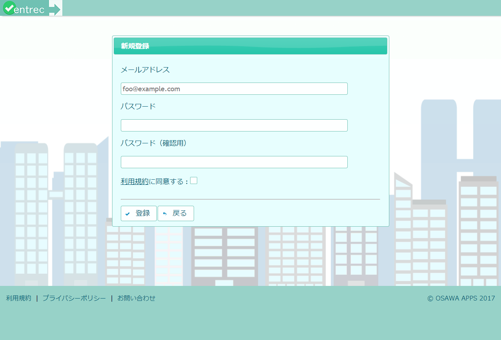
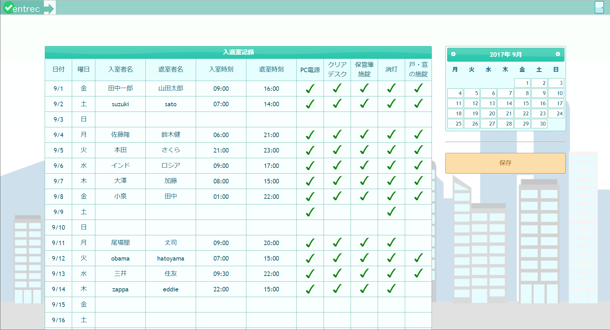

# 入退室記録アプリ (javaEE7 Practice)

## 概要

* 部屋に入ったり出たりした人や時間の記録をつける。

* 会社などの組織内にあるサーバにデプロイしてLAN内部で使う想定。

* どのユーザでログインしても記録表は同じ。組織ごとに記録表を分ける実装は今のところない。

## 画面

* ログイン

* 新規ユーザ登録

* 記録表

## 開発環境

* JDK1.8

* JavaEE7, JSF2.2

* Eclipse

* MySQL

* Payara

## 開発環境構築手順

* [こちら（Excelファイル）](readme/開発環境構築手順.xlsx "こちら（Excelファイル）")

## 対応ブラウザ

* Chrome のみ（他のブラウザは動作未検証）

- - -

## 注意

* 入力チェックなどいろいろ未実装。

