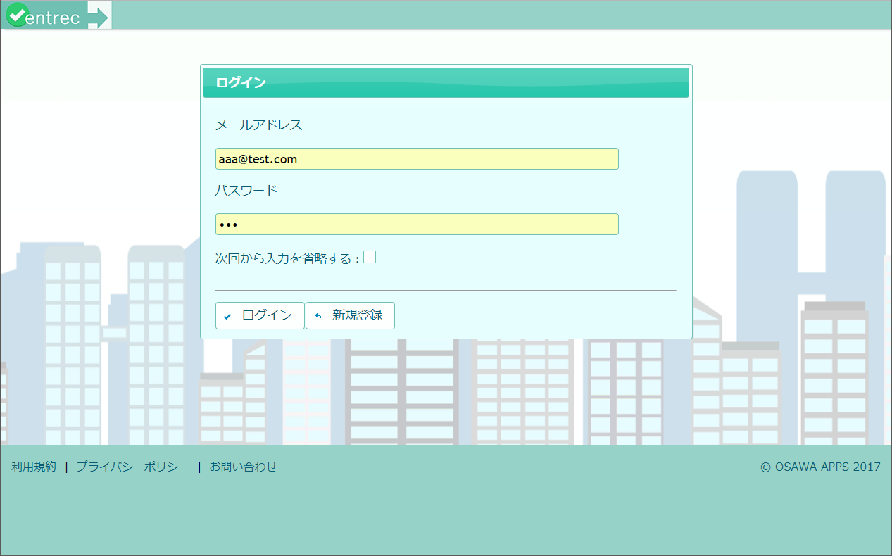

# 入退室記録アプリ (javaEE7 Practice)

## 概要

* 部屋に入ったり出たりした人や時間などの記録をつける。

* 会社などの組織内にあるサーバにデプロイしてLAN内部で使う想定。

* どのユーザでログインしても記録表は同じ。ユーザや組織ごとに記録表を分ける実装は今のところない。

## 画面

* 記録表

右側のカレンダーの日にちをクリックすると、カレンダーの月で左側の記録表が再描画される。

 

* ログイン

 

* 新規ユーザ登録

## 開発環境

* JDK1.8

* JavaEE7, JSF2.2, PrimeFaces, PrimeFaces Extensions

* Eclipse

* MySQL

* Payara

## 開発環境構築手順

* [こちら（Excelファイル）](readme/開発環境構築手順.xlsx "こちら（Excelファイル）")

## 対応ブラウザ

* Chrome のみ（他のブラウザは動作未検証）

